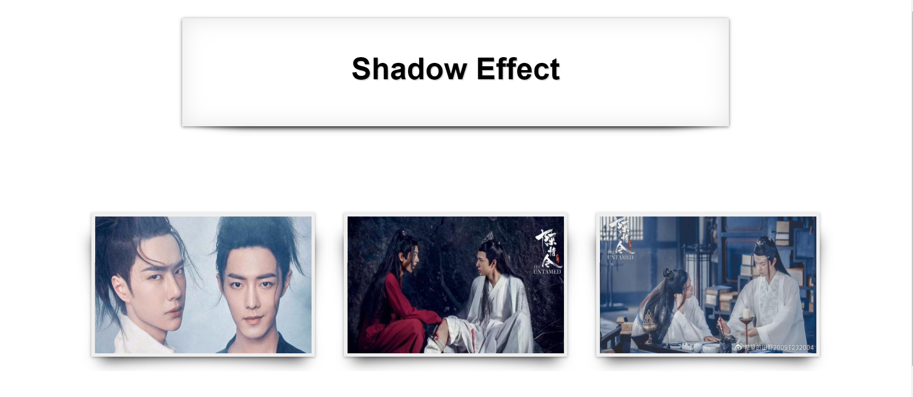
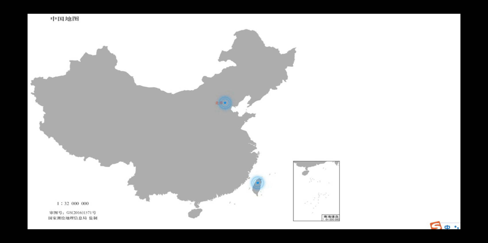
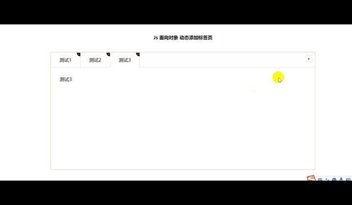
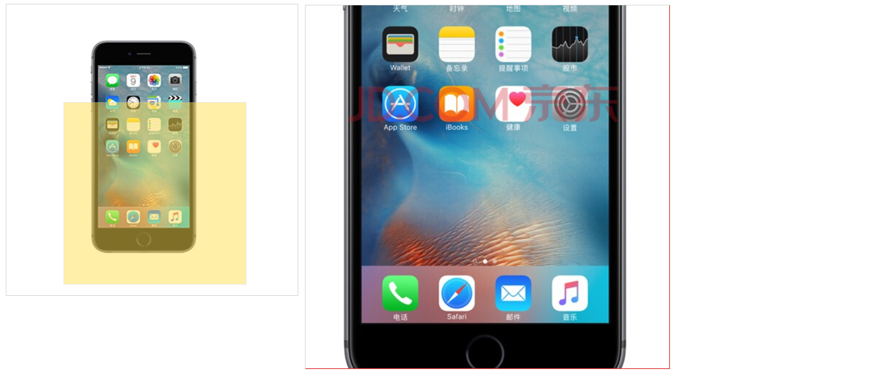
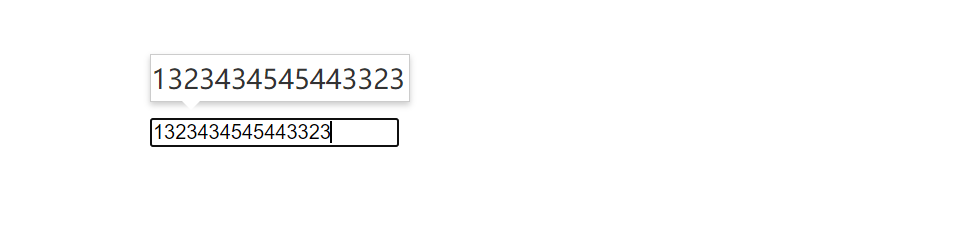
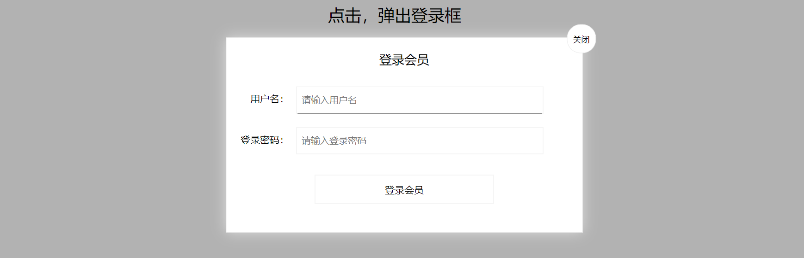
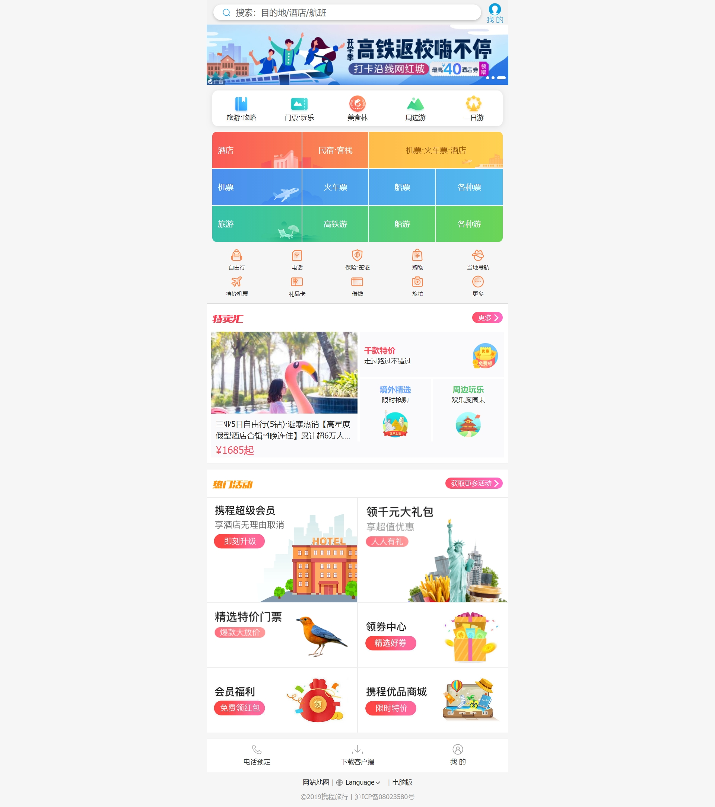

# Some-demos

### 简介

本仓库主要包含了todolist待办事项、电梯导航、购物车结算页、慕课课程《从psd到html》、旋转木马轮播图

**CSS3：**曲线阴影&翘边阴影、3D导航栏、CSS3无缝轮播、坐标闪烁动画、两面翻转盒子、旋转木马轮播

**JS：**动态增删改tab栏、JS轮播图、表单全选取消全选、条件查询商品、单元格删除、点击换肤效果、短信倒计时、放大镜效果、键盘移动盒子、筋斗云、留言删除留言、密码提示信息、模拟京东快递单号查询、鼠标拖拽盒子、鼠标在盒子里坐标、拖动模态框（登录框）、密码显示隐藏

**移动端布局：**bootstrap布局（阿里百秀）、flex布局（携程）、rem布局（苏宁易购）、流体布局（京东）、移动端轮播图

编写的代码均有详细的注释。具体介绍如下所示

### 购物车结算页

主要使用jQuery进行编写。主要功能有全选按钮，删除选中商品，清除购物车，移除商品，商品数量增减，商品总数量动态改变，单个商品价格随着数量的增大而增加，商品总价是选中商品价格总和。

图片展示如下

### 旋转木马轮播图

使用原生JS实现，可左右点击轮播也可自动轮播，图片展示如下。

### todolist待办事项

主要使用了jQuery进行编写，将数据存储在了localStorage中，打开新的标签页数据也不会被删除。

图片展示如下

### 慕课课程《从psd到html》

此课程主要是为了学习PS切图流程与技巧，图片展示如下

### 电梯导航

主要用jQuery进行实现，不同的导航对应不同的部分，里面封装了一个缓动动画函数，点击电梯导航里的菜单会变速移动到网页对应的区域。当滚动条在顶部区域时，电梯导航自动隐藏。

### CSS3小例子

主要包括了曲线阴影&翘边阴影、3D导航栏、CSS3无缝轮播、坐标闪烁动画、两面翻转盒子、旋转木马轮播等。

图片展示如下

##### 曲线阴影&翘边阴影

##### 3D导航栏

##### CSS3无缝轮播

##### 坐标闪烁动画

##### 两面翻转盒子

##### 旋转木马轮播

### JS小例子

主要包括了动态增删改tab栏、JS轮播图、表单全选取消全选、条件查询商品、单元格删除、点击换肤效果、短信倒计时、放大镜效果、键盘移动盒子、筋斗云、留言删除留言、密码提示信息、模拟京东快递单号查询、鼠标拖拽盒子、鼠标在盒子里坐标、拖动模态框（登录框）、密码显示隐藏等。

图片展示如下

##### 动态增删改tab栏

##### JS轮播图

##### 条件查询商品

##### 点击换肤效果

##### 短信倒计时

##### 放大镜效果

##### 键盘移动盒子

##### 筋斗云

##### 模拟京东快递单号查询

##### 鼠标在盒子里坐标

##### 拖动模态框（登录框）

##### 密码显示隐藏

### 移动端布局

主要包括bootstrap布局（阿里百秀）、flex布局（携程）、rem布局（苏宁易购）、流体布局（京东）、移动端轮播图等。

图片展示如下

##### bootstrap布局（阿里百秀）

##### flex布局（携程）

##### rem布局（苏宁易购）

##### 流体布局（京东）

##### 移动端轮播图

### animate.js

这是一个封装的缓动动画函数，可改变元素的一些属性以及透明度。